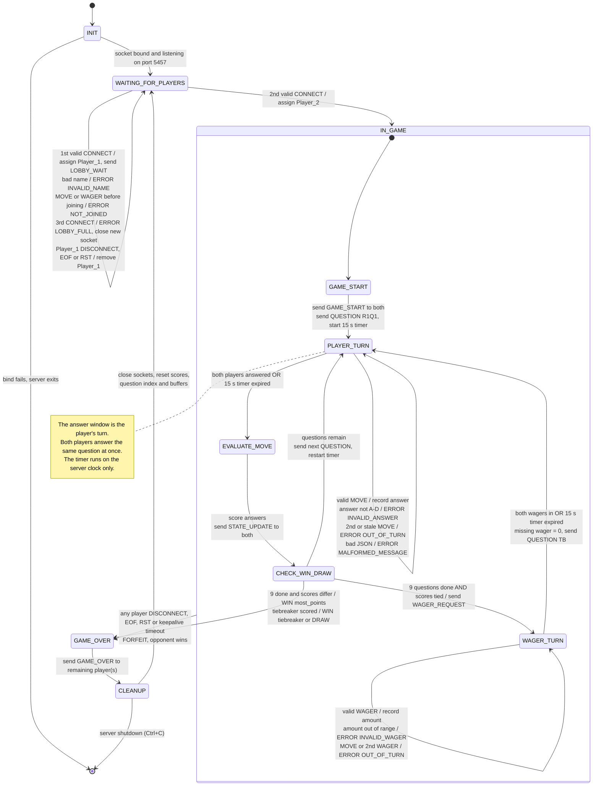

# Terminal Trivia: Server Game State Machine (FSM) Specification

**Course:** CS 457 Computer Networks, Sprint 1
**Author:** Jason Arthur

This document defines the server-side finite state machine that runs one game of Terminal Trivia.
Every message named here (`CONNECT`, `MOVE`, `ERROR`, ...) is defined in
[`protocol_blueprint.md`](protocol_blueprint.md), and every transition is triggered by either one of
those messages, a socket event (EOF, exception), or the server's own 15-second answer timer.

The server runs exactly one game room at a time. When a game ends, the room is reset and the server
goes back to waiting for two new players.

---

## 1. State Diagram

`IN_GAME` is a composite state. Entering it from the lobby always starts at `GAME_START`. It exists so that the disconnect rule ("any disconnect after the
game starts is a forfeit") is drawn once instead of once per inner state.

---

## 2. State Descriptions

| State | What the server is doing | Entry actions | Exits to |
|---|---|---|---|
| `INIT` | Starting up. | Load the question bank (3 rounds x 3 questions + 1 tiebreaker), create the listening socket, `bind(("0.0.0.0", 5457))`, `listen()`. | `WAITING_FOR_PLAYERS` |
| `WAITING_FOR_PLAYERS` | Lobby. Accepting connections and waiting for two valid `CONNECT` messages. | Room is empty or has only `Player_1`. | `GAME_START` |
| `GAME_START` | Both players are known. Roles are fixed by connection order: first valid `CONNECT` is `Player_1`, second is `Player_2`. | Send each client its own `GAME_START` (`your_id`, both names), set both scores to 0, set round = 1, question = 1. | `PLAYER_TURN` |
| `PLAYER_TURN` | An answer window is open for the current question. | Broadcast `QUESTION`, mark both players "not answered", start the 15 s server timer. | `EVALUATE_MOVE` |
| `EVALUATE_MOVE` | The window is closed; no more `MOVE`s are accepted for this question. | Compare each recorded answer to the correct one, award 100 / 200 / 300 points (or apply the wager for `TB`), broadcast `STATE_UPDATE`. | `CHECK_WIN_DRAW` |
| `CHECK_WIN_DRAW` | Decides what comes next. | Look at the question index and the scores. | `PLAYER_TURN`, `WAGER_TURN`, or game decided |
| `WAGER_TURN` | Tiebreaker wager window (only if tied after round 3). | Send each player `WAGER_REQUEST` with `max_wager` = their score, start a 15 s timer. | `PLAYER_TURN` (tiebreaker question) |
| `GAME_OVER` | Final result is known. | Broadcast `GAME_OVER` with `result`, `winner`, `reason`, `final_scores`. Sends are wrapped in `try/except` because a player may already be gone. | `CLEANUP` |
| `CLEANUP` | Tearing down the finished game. | `shutdown()` and `close()` both client sockets, clear per-connection buffers, reset scores, question index, wagers and roles. | `WAITING_FOR_PLAYERS` (next game) |

---

## 3. Transition Table

### 3.1 Happy path

| # | From | Trigger | Guard | Action | To |
|---|---|---|---|---|---|
| T1 | `INIT` | listening socket ready | | | `WAITING_FOR_PLAYERS` |
| T2 | `WAITING_FOR_PLAYERS` | `CONNECT` | room empty, name valid | assign `Player_1`, send `LOBBY_WAIT` | `WAITING_FOR_PLAYERS` |
| T3 | `WAITING_FOR_PLAYERS` | `CONNECT` | `Player_1` present, name valid | assign `Player_2` | `GAME_START` |
| T4 | `GAME_START` | (automatic) | | send `GAME_START` to each, send `QUESTION` R1Q1, start timer | `PLAYER_TURN` |
| T5 | `PLAYER_TURN` | `MOVE` | window open for that player, `question_id` matches, answer in A-D | record answer, close that player's window | `PLAYER_TURN` |
| T6 | `PLAYER_TURN` | both answered **or** timer expired | | cancel timer; unanswered player gets `answer: null` | `EVALUATE_MOVE` |
| T7 | `EVALUATE_MOVE` | (automatic) | | score, send `STATE_UPDATE` | `CHECK_WIN_DRAW` |
| T8 | `CHECK_WIN_DRAW` | (automatic) | fewer than 9 questions asked | advance question (round = 1 + index / 3), send `QUESTION`, start timer | `PLAYER_TURN` |
| T9 | `CHECK_WIN_DRAW` | (automatic) | 9 asked, scores differ | `result: WIN`, `reason: most_points` | `GAME_OVER` |
| T10 | `CHECK_WIN_DRAW` | (automatic) | 9 asked, scores tied | send `WAGER_REQUEST`, start timer | `WAGER_TURN` |
| T11 | `WAGER_TURN` | `WAGER` | wager window open for that player, 0 <= amount <= score | record amount | `WAGER_TURN` |
| T12 | `WAGER_TURN` | both wagered **or** timer expired | | missing wager = 0, send `QUESTION` TB, start timer | `PLAYER_TURN` |
| T13 | `CHECK_WIN_DRAW` | (automatic) | tiebreaker scored, scores differ | `result: WIN`, `reason: tiebreaker` | `GAME_OVER` |
| T14 | `CHECK_WIN_DRAW` | (automatic) | tiebreaker scored, still tied | `result: DRAW`, `reason: tied_after_tiebreaker` | `GAME_OVER` |
| T15 | `GAME_OVER` | (automatic) | | send `GAME_OVER` | `CLEANUP` |
| T16 | `CLEANUP` | (automatic) | | close sockets, reset room | `WAITING_FOR_PLAYERS` |

Tiebreaker scoring in `EVALUATE_MOVE`: a correct answer adds `2 x wager`; a wrong or missing answer
subtracts `wager`.

### 3.2 Invalid and out-of-turn messages

None of these change state, end the game, or stop the receive loop. The server sends an `ERROR` to
the offending client only, discards the message, and keeps going.

| State | Bad input | Response |
|---|---|---|
| any | Frame is not UTF-8 / JSON, or a required key is missing or the wrong type | `ERROR MALFORMED_MESSAGE` |
| any | `msg_type` is not a client-to-server type | `ERROR UNKNOWN_MSG_TYPE` |
| any | `player_id` does not match the role bound to this socket | `ERROR ID_MISMATCH` |
| `WAITING_FOR_PLAYERS` | `CONNECT` with an invalid `player_name` | `ERROR INVALID_NAME` (client may retry) |
| `WAITING_FOR_PLAYERS` | `MOVE` / `WAGER` before joining | `ERROR NOT_JOINED` |
| `PLAYER_TURN` | `MOVE` with `answer` not A-D | `ERROR INVALID_ANSWER`; that player's window stays open |
| `PLAYER_TURN` | second `MOVE` for the same question | `ERROR OUT_OF_TURN`; first answer stands |
| `PLAYER_TURN` | `MOVE` with an old `question_id` | `ERROR OUT_OF_TURN` |
| `PLAYER_TURN` | `WAGER` | `ERROR OUT_OF_TURN` |
| `EVALUATE_MOVE`, `CHECK_WIN_DRAW`, `GAME_START` | any `MOVE` / `WAGER` (no window open) | `ERROR OUT_OF_TURN` |
| `WAGER_TURN` | `WAGER` amount < 0, > score, or not an integer | `ERROR INVALID_WAGER`; window stays open |
| `WAGER_TURN` | `MOVE`, or a second `WAGER` | `ERROR OUT_OF_TURN` |
| any after `GAME_START` | a new client sends `CONNECT` | `ERROR LOBBY_FULL`, close that new socket only |
| any | more than 4096 bytes buffered without `\n` | `ERROR FRAME_TOO_LARGE`, then treat as a disconnect of that player |

### 3.3 Disconnects

A disconnect is any of: a `DISCONNECT` message, `recv()` returning `b""` (EOF/FIN),
`ConnectionResetError`, `BrokenPipeError`, `ConnectionAbortedError`, or `TimeoutError` from TCP
keepalive. All of them call the same `handle_client_disconnect(player)`.

| State when it happens | Result |
|---|---|
| `WAITING_FOR_PLAYERS` (only `Player_1` connected) | Remove `Player_1`, close the socket, stay in `WAITING_FOR_PLAYERS`. No game existed, so there is no forfeit. |
| Any state inside `IN_GAME`, one player drops | `GAME_OVER` with `result: FORFEIT`, `winner` = the remaining player, `reason: opponent_quit` (for `DISCONNECT`) or `opponent_disconnected` (for EOF / exceptions). Then `CLEANUP`. |
| Inside `IN_GAME`, both players drop | `GAME_OVER` is attempted; both sends fail and are caught. Then `CLEANUP`. |
| `GAME_OVER` or `CLEANUP` | Ignored; the sockets are being closed anyway. |

A pending 15 s timer is cancelled on entry to `GAME_OVER`, so a timer that fires late can never
move a finished game back into `EVALUATE_MOVE`.

---

## 4. Example Runs

**Normal game (no tie).**
`INIT` -> `WAITING_FOR_PLAYERS` (Alice connects, `LOBBY_WAIT`) -> Bob connects -> `GAME_START` ->
(`PLAYER_TURN` -> `EVALUATE_MOVE` -> `CHECK_WIN_DRAW`) x 9 -> `GAME_OVER` (`WIN`, `most_points`) ->
`CLEANUP` -> `WAITING_FOR_PLAYERS`.

**Tie after round 3.**
... -> 9th `CHECK_WIN_DRAW` (900 - 900) -> `WAGER_TURN` -> `PLAYER_TURN` (TB) -> `EVALUATE_MOVE` ->
`CHECK_WIN_DRAW` -> `GAME_OVER` (`WIN`, `tiebreaker` or `DRAW`) -> `CLEANUP`.

**Out-of-turn answer.**
In `PLAYER_TURN` for R2Q1, Alice sends `MOVE B` (recorded), then `MOVE C`. The server sends Alice
`ERROR OUT_OF_TURN`, keeps `B`, and stays in `PLAYER_TURN` until Bob answers or the timer expires.

**Abrupt disconnect.**
In `PLAYER_TURN` for R3Q2, Bob's CML link is cut. TCP keepalive fails, `recv()` on Bob's socket
raises `TimeoutError`, and `handle_client_disconnect(Player_2)` moves the game to `GAME_OVER`. Alice
receives `GAME_OVER` (`FORFEIT`, `winner: Player_1`, `reason: opponent_disconnected`). The server
goes to `CLEANUP` and then back to `WAITING_FOR_PLAYERS` for the next pair.
